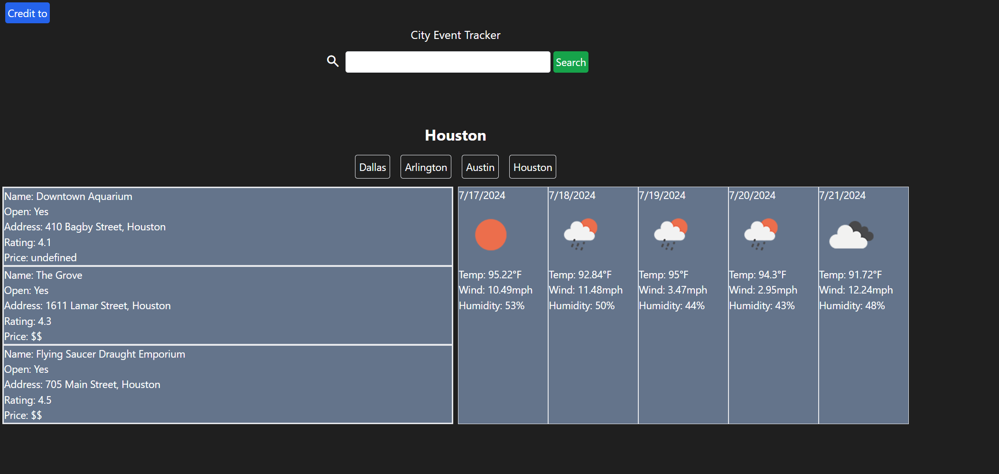
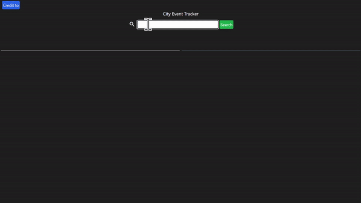

# City Event tracker 1.0
Know what’s going on in any city. 

## Description
City Event Tracker is a web application designed to help users explore local events and the current weather in a city. By combining data from Google Places and Open Weather API, users can easily discover what's happening around them and plan their activities accordingly. The user-friendly interface, built with HTML, CSS, Tailwind, and JavaScript, ensures a smooth and engaging experience.

## Collaborators
jacobmrobison23 https://github.com/jacobmrobison23

Drew-Andersen https://github.com/Drew-Andersen

DJdevjams https://github.com/DJdevjams

## How to Use
1. Open `https://djdevjams.github.io/city_eventtracker/` in your browser.
2. Enter a city in the search bar.
3. Click the search button.

## Technologies Used

 

## API's used

## Mock-Up

Wireframe - https://github.com/DJDEVJAMS/city_eventtracker/blob/main/assets/images/wireframing.png

Static site link - https://djdevjams.github.io/city_eventtracker/

Screenshot of site

## Testing

All buttons work as expected. : Verified ✅
>
All text is ledgible. : Verified ✅
>
All images are visable and labed with alt text. : Verified ✅

The following image shows the web application's appearance and functionality:

![The City Event Tracker web application provides a list of events and the weather]!

Functionality:

